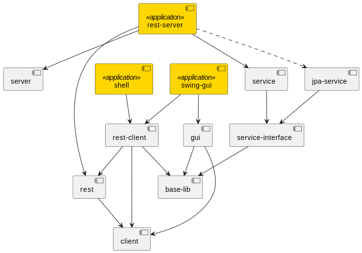

# Architecture 

This document contains architecture descriptions and documentation.

## Introduction & Goals

### Requirements Overview

* The application should work with up to ten players and one game master.
* It should manage up to 2000 different tokens and 100 maps.

### Quality Goals

* SOLID
* TDD
* Minimal amount of code.

### Relevant Stakeholders

* People, which don't want to play pen and papers online.

## Architecture Constraints

* Clean Architecture (hexagonal architecture).
* Trying a domain and transaction based implementation.

## Context & Scope

TBD

## Solution Strategy

TBD

## Building Block View

### Context Diagram

### Module Diagram Level 0

Legend
* Stereotype "application" means, that the module contains a runnable application.
* Dashed lines are runtime scoped dependencies.

Modules
* **client** Logic for accessing the server component.
* **jpa-service** The JPA persistence layer implementation.
* **gui** Logic for different GUI's.
* **service** A service implementation.
* **service-interface** Interfaces and classes of the service logic.
* **rest** The base classes used by the REST server and it's clients.
* **rest-client** An implementation of the REST client.
* **rest-server** An implementation of the REST server.
* **server** General base classes for servers.
* **shell** A shell to connect with the server.
* **swing-gui** A swing GUI for the GM's side.

### Component Diagram Level 0

### Component Diagram Level 0

## Runtime View

TBD

## Deployment View

TBD

## Crosscutting Concepts

* Optimistic locking provided by JPA.

### Domain Diagram

TBD

## Architecture Decisions

### Database

* Using optimistic locking to prevent data loss while saving records.

### Data Model

* Inheritance in token and battlemap token structure for saving data accesses.

## Quality

TBD

## Risks & Technical Dept

TBD

## Glossary

TBD