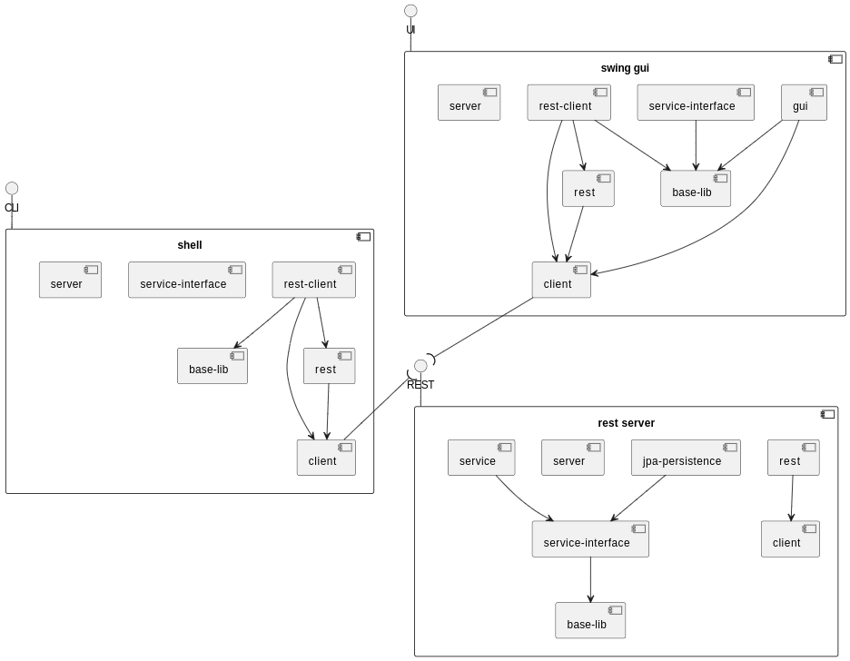

# Architecture 

This document contains architecture descriptions and documentation.

## Introduction & Goals

### Requirements Overview

* The application should work with up to ten players and one game master.
* It should manage up to 2000 different tokens and 100 maps.

### Quality Goals

* SOLID
* TDD
* Minimal code.

### Relevant Stakeholders

* People, which don't want to play pen and papers online.

## Architecture Constraints

* Clean Architecture (hexagonal architecture).
* Trying a domain and transaction based implementation.

## Context & Scope

TBD

## Solution Strategy

TBD

## Building Block View

### Component Diagram Level 1

Arrows pointing in direction of access.

**carp-bm** The service and core module with the logic. This is these application.
**carp-bm-shell** A shell application for testings, which is able to do any possible action by shell commands.

## Runtime View

TBD

## Deployment View

TBD

## Crosscutting Concepts

* Optimistic locking provided by JPA.

### Domain Diagram

TBD

## Architecture Decisions

### Database

* Using optimistic locking to prevent data loss while saving records.

## Quality

TBD

## Risks & Technical Dept

TBD

## Glossary

TBD